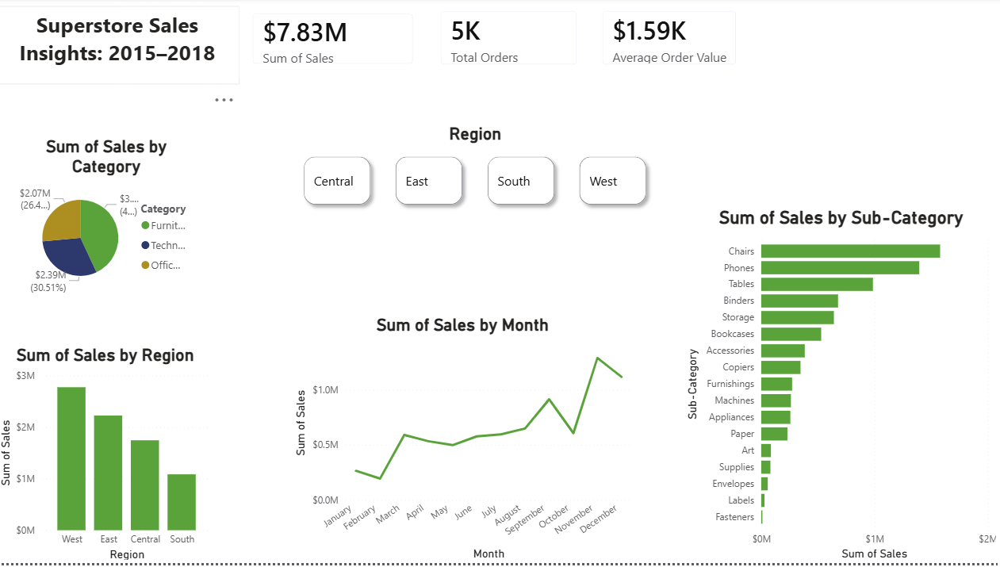

# Superstore Data Analysis: Cleaning, SQL & Power BI
# Superstore Data Analysis: Cleaning, SQL & Power BI

End-to-end analysis of retail sales data — cleaning a corrupted Kaggle dataset in Python, answering business questions in SQL, and visualizing the results in an interactive Power BI dashboard.

## Overview

This project walks through the full data analysis pipeline on the Kaggle "Sample Superstore" dataset:

1. **Data Cleaning (Python / pandas / Jupyter)** — fixed structural issues in the raw file and recovered a genuinely corrupted numeric column
2. **SQL Analysis (SQLite / DB Browser)** — answered a range of business questions using grouping, joins, subqueries, and date functions
3. **Visualization (Power BI)** — built an interactive dashboard summarizing the key findings

## Tools used
- Python (pandas) in Jupyter Notebook
- SQL (SQLite, via DB Browser for SQLite)
- Power BI Desktop

## Data Cleaning

The raw file had several real-world data quality issues, not just a "download and go" clean dataset:

- **Wrong delimiter and encoding** — semicolon-delimited, Latin-1 encoded, despite the `.csv` extension
- **Corrupted Sales column** — values were stored as text (e.g. `"$26,196"`) with the decimal point stripped out during export. Most rows lost exactly 2 decimal places, but a subset of ~76 rows lost extra precision, producing implausibly large values (e.g. $95,757.75 for a single table). These were identified by comparing the corrected values against the dataset's known plausible sales range and fixed with an additional scale correction — documented as a best-effort correction rather than a certainty.
- **Dates stored as text** in `DD/MM/YYYY` format, requiring explicit day-first parsing
- **Redundant column** (`Month & Year Order`) duplicating information already in `Order Date`
- **Missing Postal Codes** — 11 rows, all Burlington, Vermont, filled with the correct ZIP (05401) and kept as a zero-padded string rather than a number

Full process is documented in `Superstore data Clean.ipynb`.

## SQL Analysis

All queries are in [`sql.Queries.txt`](sql.Queries.txt). Highlights include:

| Question | Finding |
|---|---|
| Which region generates the most sales? | **West** leads at ~$2.77M, followed by East, Central, South |
| Which category drives the most revenue? | **Furniture** leads on total revenue, order volume *and* average order value — a consistent result across every metric |
| Best/worst selling sub-categories | **Chairs, Phones, Tables** top the list; **Fasteners, Labels, Envelopes** are the lowest by revenue (though likely high in unit volume) |
| Which month sees the most sales? | **November**, followed closely by December — a clear holiday-season spike, with January/February the slowest |
| How fast do orders ship, by Ship Mode? | Same Day ≈ 0 days, First Class ≈ 2.2 days, Second Class ≈ 3.2 days, Standard Class ≈ 5 days — shipping tiers perform exactly as promised |
| Which segment has the highest average order value? | **Corporate**, suggesting bulk or higher-spec purchasing behavior |
| How many orders does the average customer place? | ~6.2 — a strong repeat-purchase signal, not a one-off customer base |

The SQL work also includes joins across a normalized `customers` and `products` table (built from the original flat file) to demonstrate multi-table querying, alongside subqueries and date-based calculations.

## Power BI Dashboard

An interactive dashboard summarizing the analysis above — includes KPI cards (Total Sales, Total Orders, Average Order Value), a region slicer, and visuals for sales by category, region, month, and sub-category.



## Repository structure
```
├── Superstore Sales Dataset.xlsx      # Raw data
├── Superstore data Clean.ipynb        # Python cleaning process
├── sql.Queries.txt                    # SQL analysis
├── Dashboard.png                      # Power BI dashboard screenshot
└── README.md
```

## A note on data quality
This project intentionally kept the messy parts of the process visible rather than only showing a polished result. The Sales column correction in particular involved reasoning through a real ambiguity in the source data rather than a guaranteed fix — documented transparently rather than presented as certain.
